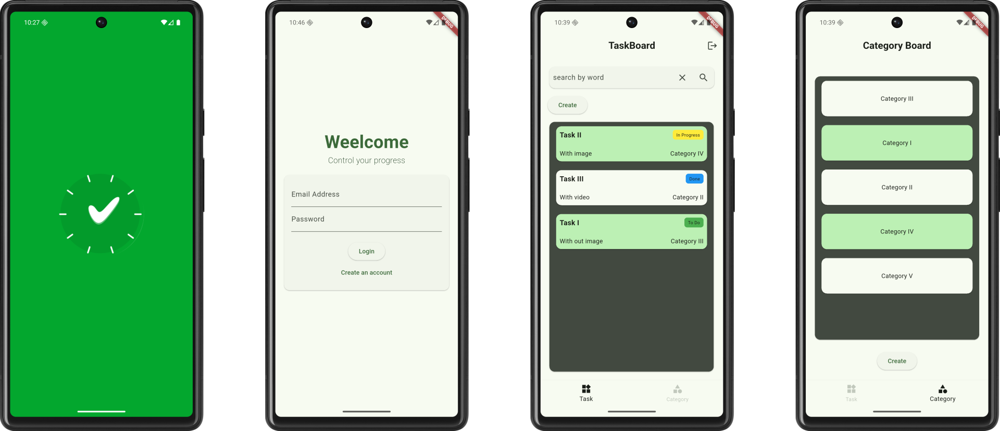
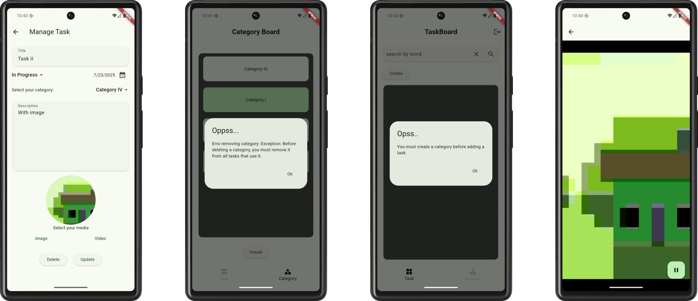

# task_list_app

# Purpose of the application
This application is built for **Android** only. The goal of this app is to help users manage their daily tasks. It supports the creation of tasks with **text, photos, and videos**, and stores all data in the **cloud using Firebase**.

# Execution
To start the software, clone this remote repository to your local repository. After that, it is recommended to make sure that everything is working in your environment with the **flutter doc** command. With your Android emulator running or a device connected to your computer/laptop via USB cable, run the **flutter run** command.

# Useful information for understanding

- This project follows a **feature-first architecture**. The **core/** folder contains shared components used across multiple features or features that could be used in the future.
- To have a functional project with its own database, it is necessary to have the [Firebase SDK](https://firebase.google.com/docs/flutter/setup?platform=android) installed and configured on the machine where development will take place, a billing account set up in your Google account, and add the following products to your Firebase dashboard:

>- Authentication (email and password authentication only)
>- Storage (for media storage)
>- Firestone database (text storage)

It is important that **if request.auth != null**  has been configured in the databases so that only authenticated users (logged in with Firebase Auth) can read or write.

### External libraries and their purposes:

- *flutter_native_splash* and *flutter_launcher_icons*: useful for streamlining the process of configuring the application icon and startup screen
- *firebase_*: libraries needed to work with Firebase without having to set up manual requests.
- *bloc*: library used to implement the BLoC pattern, mainly assisting in the creation of management control tools in a more streamlined way;
- *flutter_bloc*: used as an extension of the bloc library, used to facilitate integration between business logic (bloc) and Flutter widgets
- *page_transition*: streamlines the process of animated transitions
- *intlintl*: date formatting
- *image_picker*: for capturing images and videos, both from the camera and from the device's storage
- *video_player*: for video media playback;
- *path*: used to obtain the file name more securely when inserting it into the database. The approach *mediaFile.path.split(‘/’).last;* would be valid but could cause problems with systems that use \ as a separator.

# Images

# Final considerations

- This application is not intended for use in production.
- Although functional testing has been performed, further **stress testing and validation** are required. The repository and its Firebase database **will be deactivated soon**.
- In addition, a more thorough evaluation of **security rules and access controls** is required.

